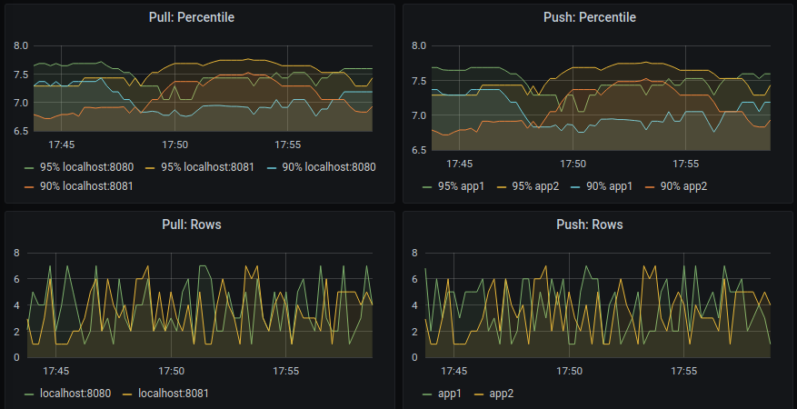
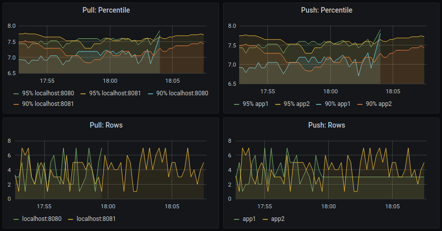

# Prometheus Pushgateway

## Quick start

When you need to get started quickly, use these instructions.

1. `docker-compose run`
2. [Open Pushgateway in a browser](http://localhost:9091/metrics)
3. [Open Prometheus in a browser](http://localhost:9090/)
4. [Open Grafana in a browser](http://localhost:3000/login) using admin/foobar

## How it all works

Prometheus provides a Pushgateway to allow to push metrics that can not be scrapped. That does not mean that we should use push model for every job or service we have. Prometheus documentation strongly recommends to use pull model but that does not mean that we can't check how to use it. And Pushgateway GitHub Readme says "Pushgateway is not capable of turning Prometheus into a push-based monitoring system".

_Please read [documentation](https://prometheus.io/docs/practices/pushing/)> carefully before consider to use Pushgateway as it describes when Pushgateway should be used._

General idea is that our service will push metrics to Pushgateway and Prometheus will scrape metrics from it. To compare, we will configure Prometheus to scrape metrics from Pushgateway and our service.

So, we need to have our service, pushgateway and prometheus running. For that we will use simple docker-compose with Prometheus, Pushgateway, Grafana and two services:

```yml
version: '3.2'
services: 
  prom-pushgateway:
    image: prom/pushgateway
    ports: 
      - 9091:9091
  prometheus:
    image: prom/prometheus
    volumes:
      - ./monitoring/prometheus/prometheus.yml:/etc/prometheus/prometheus.yml
    command:
      - '--config.file=/etc/prometheus/prometheus.yml'
      - '--storage.tsdb.path=/prometheus'
    ports:
      - 9090:9090
    network_mode: host
  app1:
    image: app:0.1
    ports:
      - "8080:8080"
    environment:
      - APP_PUSH_GATEWAY=http://prom-pushgateway:9091
  app2:
    image: app:0.1
    ports:
      - "8081:8080"
    environment:
      - APP_PUSH_GATEWAY=http://prom-pushgateway:9091
```

Prometheus config where we have two jobs, for Pushgateway and for our services:

```yml
global:
  scrape_interval: 15s
  scrape_timeout: 1s
  evaluation_interval: 15s
scrape_configs:
- job_name: dev-push-gateway
  metrics_path: /metrics
  scheme: http
  static_configs:
  - targets: ['localhost:9091']
    labels:
      service: 'prom-pushgateway'
- job_name: dev-app
  metrics_path: /metrics
  scheme: http
  static_configs:
  - targets: ['localhost:8080', "localhost:8081"]
    labels:
      service: 'app-service'
```

In our service we initialize counters as we usually do:

```golang
func init() {
  totalCounter = prometheus.NewCounterVec(prometheus.CounterOpts{
    Name: "service_total_count",
  }, []string{"name"})
  prometheus.MustRegister(totalCounter)

  duration = prometheus.NewHistogramVec(prometheus.HistogramOpts{
      Name:    "service_duration_milliseconds",
      Buckets: []float64{1, 2, 3, 4, 5, 6, 7, 8, 9, 10},
    }, []string{"name"})
  prometheus.MustRegister(duration)

  rows = prometheus.NewGaugeVec(prometheus.GaugeOpts{
      Name: "service_rows",
    }, []string{"name"})
  prometheus.MustRegister(rows)
}


// ServiceMiddleware executes given service and updates necessary metrics.
func ServiceMiddleware(name string, service func()) func() {
  return func() {
    start := time.Now()
    defer func(start time.Time) {
      v := float64(time.Since(start).Seconds() * 1e3)
      duration.WithLabelValues(name).Observe(v)
    }(start)
    service()
    totalCounter.WithLabelValues(name).Inc()
  }
}
```

We run "docker-compose up" and now we can see our metrics in Prometheus:

```text
service_total_count{instance="localhost:8080",job="dev-app",name="action-1",service="app-service"}  22
service_total_count{instance="localhost:8081",job="dev-app",name="action-1",service="app-service"}  23
```

Everything seems to be fine and we can create Pusher and we start goroutine to push our metrics each 5 seconds:

```golang
func InitPusher(ctx context.Context, cfg *PushConfig) {
  registry := prometheus.NewRegistry()
  registry.MustRegister(duration, totalCounter, rows)
  pusher := push.New(cfg.URL, cfg.Job).Gatherer(registry)

  // start pusher
  go func() {
    ticker := time.NewTicker(cfg.Interval)

    for {
      select {
      case <-ticker.C:
        if err := pusher.Push(); err != nil {
          fmt.Println("Could not push to Pushgateway:", err)
        }
      case <-ctx.Done():
        return
      }
    }
  }()
}
```

Restart everything and we see these three lines:

```text
service_total_count{exported_job="function",instance="localhost:9091",job="dev-push-gateway",name="action-1",service="prom-pushgateway"}  1
service_total_count{instance="localhost:8080",job="dev-app",name="action-1",service="app-service"}  3
service_total_count{instance="localhost:8081",job="dev-app",name="action-1",service="app-service"}  3
```

There are two issues here. First, we have exported_job label for our prom-pushgateway, but that is easy to solve: we have to add ` honor_labels: true ` to the Prometheus config file. Second, we have don't have metrics from one of the services and we don't know which one. If we check metrics for [Pushgateway](http://localhost:9091/metrics) we can see that it is not consistent and service overwrites metrics from another one:

```text
service_total_count{job="function",name="action-1"} 98
```

After couple of seconds:

```text
service_total_count{job="function",name="action-1"} 315
```

Normally, Prometheus adds instance label for each target it scrapes and we can see all the metrics. In our case, we have to it by ourselves. Again, it is not recommended to do, but we simply want to investigate a little bit more.
We can achieve that using [Grouping](https://godoc.org/github.com/prometheus/client_golang/prometheus/push#Pusher.Grouping):

```text
pusher := push.New(cfg.URL, cfg.Job).Gatherer(registry).Grouping("instance", cfg.Instance)
```

And now we have all metrics:

```text
service_total_count{instance="app1",job="app-service",name="action-1",service="prom-pushgateway"} 17
service_total_count{instance="app2",job="app-service",name="action-1",service="prom-pushgateway"} 17
service_total_count{instance="localhost:8080",job="dev-app",name="action-1",service="app-service"}  18
service_total_count{instance="localhost:8081",job="dev-app",name="action-1",service="app-service"}  18
```

Ok, now we can add Grafana boards for visualization and everything looks normal:


Now, let's stop one of the services (app1). As we can see, one of the metrics "is lying" to us: 

The reason is that Pushgateway will not remove any metrics. Even if our service is stopped we can see that Pushgateway has metrics for it:

```text
service_rows{instance="app1",job="app-service",name="action-1"} 3
service_rows{instance="app2",job="app-service",name="action-1"} 1
```

Links:

- https://prometheus.io/docs/practices/pushing/
- https://github.com/prometheus/pushgateway
- https://www.robustperception.io/common-pitfalls-when-using-the-pushgateway
- https://github.com/prometheus-community/PushProx
